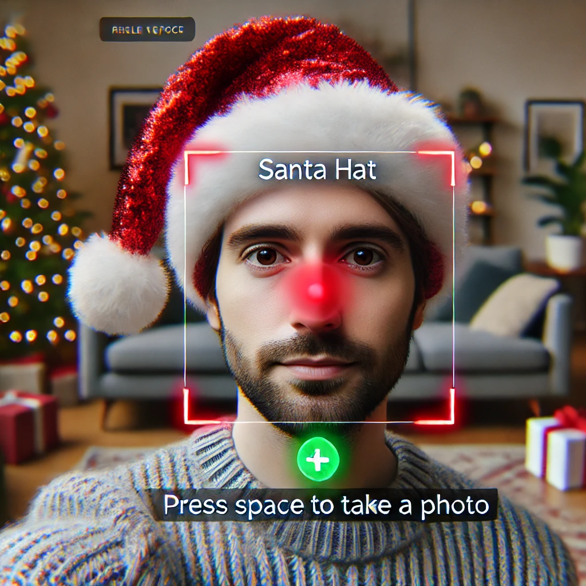

# Santa Hat + Face Detection with YOLO 🎅📸

This project uses YOLO face detection to overlay a Santa hat on the head of the detected faces in real-time. It provides fun and interactive functionality for capturing festive photos.

---

## Features
- Real-time face detection using the YOLO model.
- Dynamically scaled and positioned Santa hats on detected faces.
- Saves photos with a single key press (`SPACE`).
- Automatically resumes numbering of saved images if the script is re-run.
- Full-screen live display with clear instructions.

---
## Example Output

Here’s an example of the Santa hat detection in action:



---

## Installation

### 1. Clone the Repository
```bash
git clone https://github.com/rajithadesilva/yolo-santa-hat.git
cd yolo-santa-hat
```

### 2. Install Dependencies
Ensure you have Python installed and then run:
```bash
pip install -r requirements.txt
```
---
## Usage

### Run the Script
```bash
python santa_hat.py
```
---
## Controls

- **Press `SPACE`**: Capture the current frame as a photo. Photos are saved in the `photos` directory.
- **Press `Q`**: Quit the application.
---
## Customization

### Adjust Santa Hat Position and Size
You can adjust the size and position of the Santa hat by modifying the following variables in `santa_hat.py`:

```python
HAT_SCALE_FACTOR = 1.5  # Adjust hat size relative to face width
HAT_OFFSET_X = -0.1     # Horizontal offset as a fraction of face width (-1.0 to 1.0)
HAT_OFFSET_Y = -0.4     # Vertical offset as a fraction of face height (-1.0 to 1.0)
```
### Add a different hat
- Replace the santa_hat.png image with a new transparent hat image of your choosing.
  
### Change Output Directory
By default, photos are saved in the `photos/` directory. You can change this by modifying the following line in `santa_hat.py`:

```python
output_dir = "your_new_directory_name"
```
---
## Requirements
- Python 3.7+
- OpenCV
- Ultralytics YOLO
- NumPy

---
## Contributing

Feel free to submit issues or pull requests for new features or improvements. Contributions are always welcome! 😊
